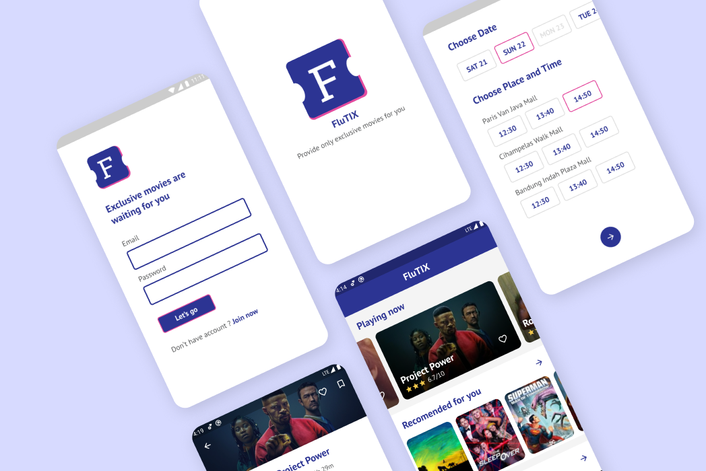

# FluTIX-Flutter

FluTIX is app built with Flutter. App for purchase cinema ticket

## Inside The App

  - BLoc Design Pattern
  - RXDart State Management
  - GetIt for Depedency Injector
  - Firebase Authentication
  - Firebase Firestore
  - Movie API from https://www.themoviedb.org/
  - Google Font Package https://pub.dev/packages/google_fonts
  - FL Chart Package https://pub.dev/packages/fl_chart
  - Intl Package https://pub.dev/packages/intl
  - Http Package https://pub.dev/packages/http
  

